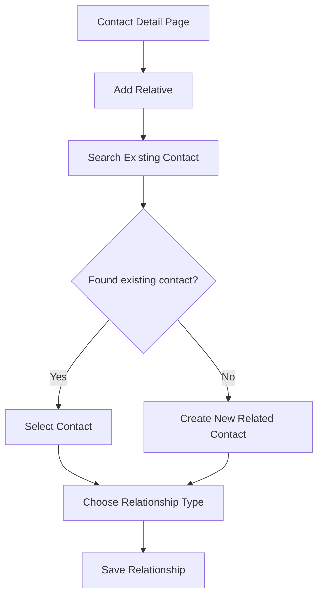
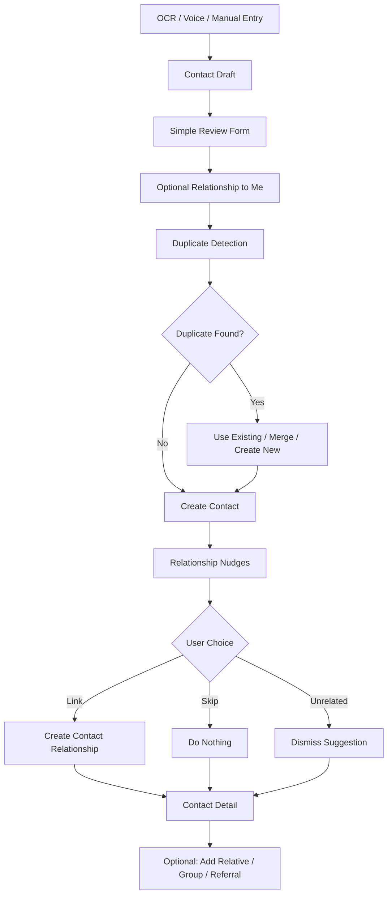

# Contact Creation UX Flow

## Core UX Principle

The app should be smart without making the user do database work.

During initial contact creation, the form only focuses on:

- Who this contact is.
- How to reach them.
- What their relationship is to the user or business.

Contact-to-contact relationships, groups, and referrals are optional assistive features.

## Initial Creation Form

The creation form should stay simple.

Primary fields:

- Full Name
- Designation/Title
- Company
- Email(s)
- Phone Number(s)
- Website
- Address
- Relationship to Me

The relationship-to-user field is optional.

Examples:

- Client
- Vendor
- Accountant
- Attorney
- Contractor
- Friend
- Other

This maps to:

```text
contacts.relationship_to_user
```

It does not create a contact-to-contact graph relationship.

## Smart Relationship Nudges

After OCR, voice parsing, or manual entry creates a contact draft, the app can look for possible existing relationships.

Example:

```text
New contact: John Doe
Existing contact: Sarah Doe
Reason: same last name
```

The UI can show:

```text
John Doe may be related to Sarah Doe.

[Link Relationship] [Skip] [Unrelated]
```

This should be a nudge, not a requirement.

## Nudge Signals

Possible signals:

- Same last name, only as a soft post-save nudge.
- Same company.
- Same email domain.
- Same website domain.
- Same address.
- Voice phrase such as `John is Sarah's brother`.
- User manually chooses a possible related contact.

## Nudge Actions

### Link Relationship

The user chooses a relationship type.

Family options:

- Mother
- Father
- Son
- Daughter
- Brother
- Sister
- Relative

Professional options:

- Business Partner
- Manager
- Assistant
- Other

### Skip

The app does nothing and continues.

Use this when the user does not want to decide right now.

### Unrelated

The app treats the suggestion as intentionally rejected.

For MVP, this can simply dismiss the suggestion. Later, we can store dismissed suggestions to avoid showing them again.

## Post-Save Relationship Actions

After a contact is saved, the detail page should expose optional actions:

```text
Add Relative
Add Professional Link
Add to Group
Add Referral Source
```

These actions are not required during creation.

## Add Relative Flow

Default flow should prefer existing contacts:



Defaulting to existing contact makes sense because relationship linking is usually between contacts already in the system.

## Referral Tracking

Referral tracking answers:

```text
How did I get this contact?
Who made me meet this contact?
```

This is different from family or professional relationship.

Example:

```text
Sarah Doe referred John Doe.
```

Suggested UI:

```text
Referral Source
[ Search existing contact... ]
```

Backend mapping:

```text
contact_relationships.from_contact_id = John Doe
contact_relationships.to_contact_id = Sarah Doe
contact_relationships.relationship_type = referred_by
```

## Creation Flow Diagram



## Important Product Boundary

The app should not force the user to maintain a full relationship graph.

The graph should grow from:

- user-confirmed suggestions,
- post-save relationship actions,
- explicit referral tracking,
- and optional groups.

This keeps the first-time contact creation experience fast while still allowing a richer contact manager over time.
