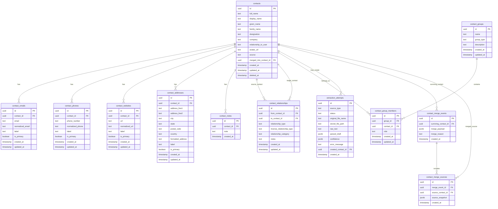

# Database ER Design

## Purpose

This document defines the fortified base database design for the Business Card Scanner & Smart Contact Manager.

The design assumes the application is its own contact manager. OCR and voice input create contact drafts, but saved contacts, duplicate detection, merge behavior, relationship links, and groups are owned by this application's PostgreSQL database.

This schema may evolve during implementation, but it gives us a strong starting point for Drizzle ORM modeling and API design.

## Design Goals

- Store contacts as first-class records.
- Support multiple emails, phone numbers, addresses, and websites per contact.
- Support direct contact-to-contact relationships.
- Support multi-contact groups.
- Support duplicate detection by normalized email, phone, name, company, and website.
- Support contact merge operations.
- Preserve OCR/voice extraction history for auditing and debugging.
- Keep the schema normalized enough to show strong database design.

## Main Entity Model



## Contact Core

### `contacts`

Stores the primary contact record.

Important fields:

- `full_name`: the full extracted or manually entered name.
- `display_name`: the name shown in UI; can differ from legal/full name.
- `given_name`, `family_name`: optional structured name fields.
- `designation`: title or role, such as Sales Manager.
- `company`: company or organization.
- `relationship_to_user`: optional relationship between the app owner/business and this contact, such as Client, Vendor, Accountant, Attorney, Contractor, Friend.
- `source`: optional value such as `manual`, `business_card`, `voice`, or `merge`.
- `merged_into_contact_id`: optional self-reference used when this contact has been merged into another contact.
- `deleted_at`: enables soft delete instead of hard delete.

Why this table is intentionally not overloaded:

- Emails, phones, websites, and addresses are separated because contacts can have multiple values.
- Relationship graph and group membership are separate because they are many-to-many concepts.

## Contact Details

### `contact_emails`

Stores one or more email addresses for each contact.

Recommended labels:

- `work`
- `personal`
- `other`

Important constraints/indexes:

- Index `contact_id`.
- Unique or partial unique index on `normalized_email` where not deleted, if we want strict email uniqueness.
- At minimum, index `normalized_email` for duplicate detection.

Normalization:

```text
John.Smith@ABC.com -> john.smith@abc.com
```

### `contact_phones`

Stores one or more phone numbers.

Recommended labels:

- `mobile`
- `office`
- `home`
- `fax`
- `other`

Important constraints/indexes:

- Index `contact_id`.
- Index `normalized_phone`.
- Unique or partial unique index on `contact_id + normalized_phone` to avoid repeated phone numbers on the same contact.

Normalization:

```text
(518) 555-1111 -> 5185551111
+1 518-555-1111 -> 15185551111
```

### `contact_websites`

Stores websites/domains.

Recommended labels:

- `company`
- `personal`
- `linkedin`
- `other`

Important constraints/indexes:

- Index `contact_id`.
- Index `normalized_url`.

Normalization:

```text
https://www.abc.com/ -> abc.com
abc.com -> abc.com
```

### `contact_addresses`

Stores one or more addresses.

Why both structured and formatted fields:

- OCR often extracts a messy formatted address.
- Manual editing may later support city/state/postal fields.
- Keeping both allows a good MVP now and cleaner address handling later.

Recommended labels:

- `office`
- `home`
- `billing`
- `other`

## Relationship Graph

### Why this is a graph, not a strict tree

The assignment gives examples like Husband -> Wife, Father -> Son, Brother -> Sister, Business Partners, and Team Members.

Real contact relationships are not always a tree:

- One contact can have many family relationships.
- One contact can have business relationships with many people.
- One contact can belong to multiple teams.
- Two contacts can have a directional relationship with an inverse label.

So the database should represent contacts as nodes and relationships as edges:

```text
contacts = nodes
contact_relationships = edges
```

### Creation-Time UX Rule

The contact creation form should not require graph details.

During initial contact creation, the form is only concerned with the new contact's relationship to the user or business:

```text
Relationship to Me
optional examples: Client, Vendor, Accountant, Attorney, Contractor, Friend
```

This field maps to:

```text
contacts.relationship_to_user
```

Contact-to-contact relationship linking should be optional and assistive.

### Relationship Nudges

The app may suggest possible relationships after a contact draft is created.

Example:

```text
Existing contact: Sarah Doe
New contact: John Doe
Signal: same family name
Nudge: "John Doe may be related to Sarah Doe."
Actions: Link Relationship / Skip / Mark Unrelated
```

The nudge should never force a relationship.

Recommended nudge sources:

- Same family name, only as a soft post-save nudge.
- Same company.
- Same domain in email or website.
- Same phone number family/account pattern.
- User says a relationship in voice input.

Recommended nudge actions:

- `link_relationship`
- `skip`
- `mark_unrelated`

Implementation note:

- For MVP, nudges can be computed dynamically and not stored.
- If repeated ignored suggestions become annoying, we can later add a `relationship_suggestion_dismissals` table.

### `contact_relationships`

Stores a direct contact-to-contact relationship.

Example:

```text
John Smith -> Jane Smith
relationship_type: spouse
inverse_relationship_type: spouse
```

Example:

```text
John Smith -> Alex Smith
relationship_type: child
inverse_relationship_type: parent
```

When viewing Alex Smith, the backend can show John Smith as `parent` by reading the inverse relationship.

Recommended relationship types:

- `spouse`
- `parent`
- `child`
- `mother`
- `father`
- `son`
- `daughter`
- `sibling`
- `brother`
- `sister`
- `relative`
- `business_partner`
- `manager`
- `assistant`
- `referred_by`
- `friend`
- `emergency_contact`
- `other`

Recommended relationship categories:

- `family`
- `business`
- `personal`
- `custom`

Important constraints/indexes:

- Index `from_contact_id`.
- Index `to_contact_id`.
- Unique index on `from_contact_id + to_contact_id + relationship_type`.
- Check that `from_contact_id != to_contact_id`.

Canonical storage rule:

- Store one row for the relationship.
- Use `relationship_type` and `inverse_relationship_type` so the UI can display the correct label from either side for supported direct mappings.
- Avoid creating duplicate opposite rows unless implementation later requires it.

### Family Relationship Rule

The app should not try to model a full genealogy system.

Supported bidirectional family mappings:

```text
mother <-> son
mother <-> daughter
father <-> son
father <-> daughter
brother <-> brother
brother <-> sister
sister <-> sister
sister <-> brother
```

Generic family fallback:

```text
relative <-> relative
```

This means the graph can show extended connected contacts, but we do not need to label every extended relationship such as great uncle, cousin once removed, or other complex family paths.

Example:

```text
John -> Alex
relationship_type: son
inverse_relationship_type: father

Alex -> Ryan
relationship_type: son
inverse_relationship_type: father
```

The UI graph can still show John, Alex, and Ryan as connected family nodes. Unless we explicitly build a computed relationship layer later, Ryan can be shown as a related family contact rather than requiring a precise `grandson` label.

### Professional Relationship Rule

Professional relationships are one-way by default.

Examples:

```text
Business Owner -> Accountant
relationship_type: accountant
relationship_category: business

Company Contact -> Attorney
relationship_type: attorney
relationship_category: business

Project Lead -> Contractor
relationship_type: contractor
relationship_category: business
```

These should not automatically create an inverse label unless the user explicitly adds one. For example, if Alice is marked as Bob's accountant, the app does not need to infer that Bob is Alice's client unless that relationship is separately entered or represented through a group.

Recommended professional relationship types:

- `client`
- `vendor`
- `accountant`
- `attorney`
- `contractor`
- `business_partner`
- `manager`
- `assistant`
- `referred_by`
- `other`

For multi-person professional associations, prefer groups:

```text
ABC Realty Team
  - John Smith, role: Sales Manager
  - Jane Smith, role: Broker

Legal Vendors
  - Priya Shah, role: Attorney
  - Aman Patel, role: Paralegal
```

Team membership should be represented through `contact_groups` and `contact_group_members`, not as a direct `team_member` relationship. This keeps one contact free to belong to multiple teams or business groups without creating noisy person-to-person edges.

### Referral Relationship Rule

Referral is stored in `contact_relationships`, not in a separate table.

Example:

```text
Sarah Doe referred John Doe.
```

Meaning:

```text
Sarah Doe is how the user found John Doe.
```

Stored as:

```text
from_contact_id: John Doe
to_contact_id: Sarah Doe
relationship_type: referred_by
relationship_category: business
```

The inverse display should be computed by the UI/API, not stored as a separate relationship type:

```text
Sarah Doe referred John Doe
```

Recommended behavior:

- Referral is optional during contact creation.
- The user can add or confirm it after saving.
- Voice input can detect phrases like `referred by Sarah Doe` and create a relationship suggestion.
- OCR usually will not infer referral unless explicitly written.

### Post-Save Relationship Linking

After the contact is saved, the detail page should offer optional relationship actions:

```text
Add Relative
Add Professional Link
Add to Group
Add Referral Source
```

The default should be to link the new contact to an existing contact, because the user is more likely to already have the related person saved.

Flow:

```text
Contact Detail -> Add Relative -> Search Existing Contact -> Pick Relationship -> Save
```

If the related person does not exist yet, the user can create a new contact from that flow.

Recommended UX:

- Default tab: Existing Contact
- Secondary option: Create New Contact
- Always allow Cancel/Skip

## Contact Groups

### Why groups are separate from direct relationships

A relationship is a direct edge:

```text
John -> spouse -> Jane
```

A group is a named collection:

```text
Smith Family
  - John
  - Jane
  - Alex
```

Both are required because the assignment says contacts can be linked together and may belong to multiple groups.

### `contact_groups`

Stores named groups.

Examples:

- `Smith Family`
- `ABC Realty Team`
- `Legal Vendors`
- `Contractor Network`

Recommended group types:

- `family`
- `business_team`
- `vendor_group`
- `client_group`
- `custom`

### `contact_group_members`

Stores many-to-many group membership.

Example:

```text
Group: Smith Family
  John Smith, role: father
  Jane Smith, role: mother
  Alex Smith, role: son
```

Important constraints/indexes:

- Unique index on `group_id + contact_id`.
- Index `contact_id`.
- Index `group_id`.

## Extraction History

### `extraction_attempts`

Stores OCR and voice extraction attempts.

Why this matters:

- Helps debug bad OCR/transcription.
- Shows evaluation maturity.
- Lets us store raw text and parsed output before user edits.
- Helps explain how a final contact was created.

Fields:

- `source_type`: `business_card` or `voice`.
- `status`: `success`, `failed`, or `partial`.
- `original_file_name`: original uploaded file name.
- `stored_file_path`: local path if upload retention is enabled.
- `raw_text`: OCR text or speech transcript.
- `parsed_draft`: JSON representation of `ContactDraft`.
- `confidence`: optional confidence scores.
- `error_message`: failure details.
- `created_contact_id`: contact created from this extraction, if any.

Upload retention should be controlled by environment configuration instead of hardcoded behavior.

Recommended environment variables:

```text
UPLOAD_STORAGE_MODE=delete_after_processing|temporary|permanent
UPLOAD_TEMP_TTL_HOURS=24
UPLOAD_STORAGE_DIR=./uploads
```

Recommended behavior:

- `delete_after_processing`: process file, store raw text and parsed draft, then delete original upload.
- `temporary`: store original upload temporarily and clean it after `UPLOAD_TEMP_TTL_HOURS`.
- `permanent`: keep original upload path in `stored_file_path`.

Important indexes:

- Index `source_type`.
- Index `created_contact_id`.
- Index `created_at`.

## Merge History

### `contact_merge_events`

Stores one merge action.

Example:

```text
surviving_contact_id: John Smith
merge_reason: duplicate_detected
merge_payload: selected field choices and conflict resolution
```

### `contact_merge_sources`

Stores contacts that were merged into the surviving contact.

Why keep source snapshots:

- It preserves what was merged.
- It makes the merge auditable.
- It helps debug accidental merges.

Implementation note:

- Merged source contacts should be hidden by default.
- Use `contacts.merged_into_contact_id` to point from the merged source contact to the surviving contact.
- Use `contacts.deleted_at` to keep merged contacts out of normal list/search results while preserving audit history.

## Duplicate Detection Support

Duplicate detection uses the normalized fields:

```text
contact_emails.normalized_email
contact_phones.normalized_phone
contacts.full_name
contacts.company
contact_websites.normalized_url
```

Recommended matching hierarchy:

```text
Exact email match: highest confidence
Exact phone match: highest confidence
Name + company match: medium/high confidence
Name + website match: medium/high confidence
Name-only match: lower confidence
```

Recommended indexes:

```text
contact_emails.normalized_email
contact_phones.normalized_phone
contact_websites.normalized_url
contacts.full_name
contacts.company
```

If we use PostgreSQL trigram similarity later, we can add:

```sql
CREATE EXTENSION IF NOT EXISTS pg_trgm;
```

Then add trigram indexes for fuzzy name/company matching.

## Drizzle-Oriented Table Plan

The Drizzle schema should likely be organized like this:

```text
server/src/db/schema/contacts.schema.ts
server/src/db/schema/contact-details.schema.ts
server/src/db/schema/contact-relationships.schema.ts
server/src/db/schema/contact-groups.schema.ts
server/src/db/schema/extractions.schema.ts
server/src/db/schema/contact-merges.schema.ts
```

This keeps table definitions readable while still allowing a single exported schema object.

## MVP Scope Recommendation

For the first implementation pass, build these tables:

- `contacts`
- `contact_emails`
- `contact_phones`
- `contact_websites`
- `contact_addresses`
- `contact_relationships`
- `contact_groups`
- `contact_group_members`
- `extraction_attempts`

Then add merge history tables if time allows:

- `contact_merge_events`
- `contact_merge_sources`

If time is tight, merge can still work without merge history, but keeping merge history is stronger for evaluation.

## Open Decisions

These can be revisited later during implementation:

- Email uniqueness: allow duplicate emails globally, but prevent duplicate emails inside the same contact. Duplicate detection warns instead of blocking.
- Merged contact handling: keep merge history, hide merged contacts by default, and set `merged_into_contact_id`.
- Relationship type storage: use text columns with code-level validation for known values, leaving room for future custom labels.
- Business relationship values: provide fixed suggestions plus custom values.
- Upload retention: control with environment variables using `delete_after_processing`, `temporary`, or `permanent` modes.
- Family relationship mapping: only explicitly map mother/father/son/daughter and brother/sister bidirectionally; use `relative` as the fallback for extended family.
- Professional relationship mapping: treat professional relationships as one-way by default; use groups for teams, vendors, and business networks.
- Creation UX: only ask for optional relationship-to-user/business during initial creation; contact-to-contact linking is suggested or added after save.
- Relationship nudges: suggest possible links from same last name/company/domain, but always provide Skip and Unrelated actions.
- Referral tracking: store referral as a one-way `contact_relationships` edge, usually `referred_by`.
