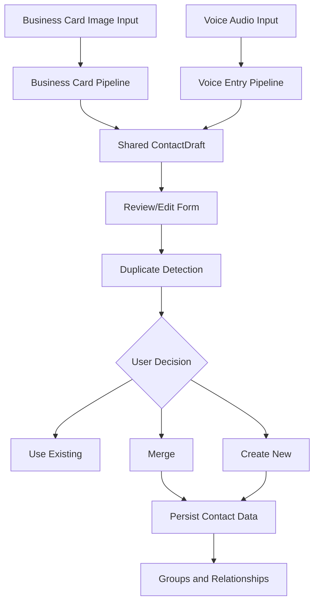
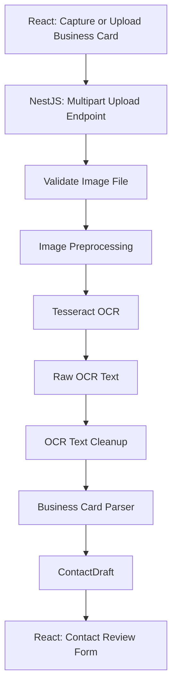
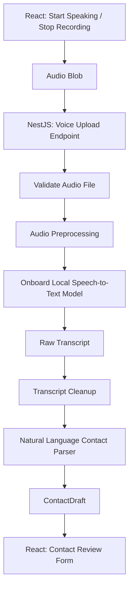
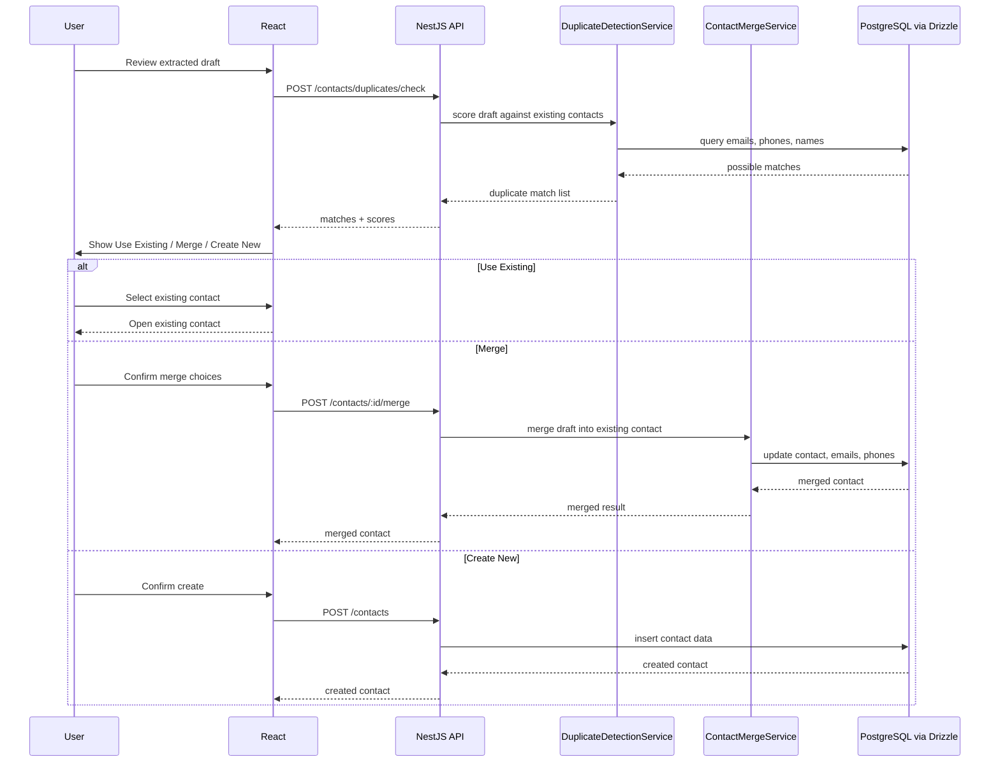
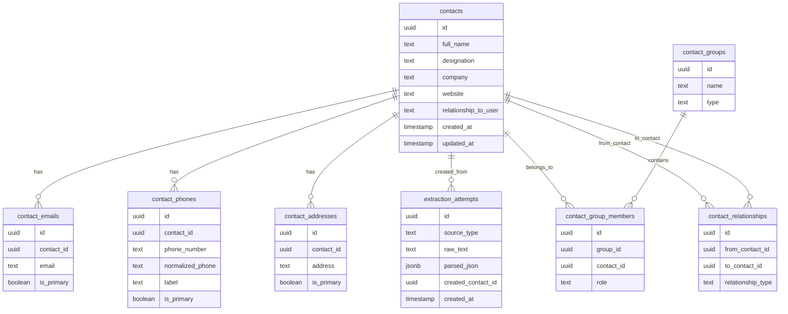
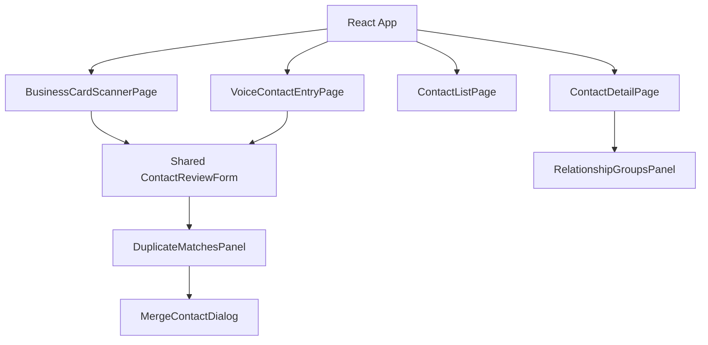

# Pipeline Architecture

## Core Architecture Principle

The application has two independent acquisition and interpretation pipelines:

- Business Card Scanner Pipeline
- Voice-Based Contact Entry Pipeline

The two pipelines are different because the inputs have different characteristics.

Business card input is image/layout/OCR driven. Voice input is audio/conversation/intent driven.

Both pipelines eventually normalize their result into the same `ContactDraft` contract. After that point, review, duplicate detection, merge, grouping, and persistence are shared.



## Shared ContactDraft Contract

Both pipelines should return the same normalized shape:

```ts
type ContactDraft = {
  fullName: string | null;
  designation: string | null;
  company: string | null;
  emails: string[];
  phones: Array<{
    label: 'mobile' | 'office' | 'home' | 'other';
    number: string;
    normalizedNumber: string;
  }>;
  website: string | null;
  address: string | null;
  relationshipToUser: string | null;
  sourceType: 'business_card' | 'voice';
  rawText: string;
  confidence?: Record<string, number>;
};
```

The downstream contact workflow should not need to know whether the draft came from OCR or voice.

## Pipeline 1: Business Card Scanner

Business card scanning starts with an image. The pipeline is optimized for OCR quality and semi-structured card text.



### Business Card Layer Details

#### 1. Frontend Image Input Layer

React provides a mobile-friendly input:

```html
<input type="file" accept="image/*" capture="environment" />
```

Responsibilities:

- Capture a new business card image.
- Upload an existing image.
- Show preview before submission.
- Submit image to the backend.

#### 2. API Boundary Layer

NestJS receives the image through a REST endpoint:

```text
POST /extractions/business-card
```

Expected response:

```json
{
  "sourceType": "business_card",
  "rawText": "John Smith\nSales Manager\nABC Realty\njohn@abc.com",
  "draft": {
    "fullName": "John Smith",
    "designation": "Sales Manager",
    "company": "ABC Realty",
    "emails": ["john@abc.com"],
    "phones": [],
    "website": null,
    "address": null,
    "relationshipToUser": null
  }
}
```

#### 3. Image Validation Layer

Checks:

- File exists.
- File MIME type is an image.
- File size is within allowed limit.
- File is readable by the OCR layer.

#### 4. Image Preprocessing Layer

Prepares the image for better OCR:

- Resize if too large.
- Convert to grayscale.
- Improve contrast.
- Normalize orientation when possible.
- Optionally deskew/crop in later versions.

#### 5. OCR Layer

Runs Tesseract locally.

Input:

```text
business-card.jpg
```

Output:

```text
raw OCR text
```

#### 6. OCR Cleanup Layer

Fixes OCR-specific problems:

- Extra whitespace.
- Broken lines.
- Odd punctuation.
- Common OCR mistakes.
- Line normalization.

#### 7. Business Card Interpretation Layer

This parser is designed for semi-structured card text.

Signals:

- Emails are extracted by regex.
- Phone numbers are extracted and normalized.
- Websites are extracted by URL/domain patterns.
- Name is inferred from prominent/top lines.
- Designation is inferred from title-like terms.
- Company is inferred from nearby organization-like lines.
- Address is inferred from multi-line location patterns.

This parser should not pretend the OCR text is natural speech. It should use line order and card-like structure.

## Pipeline 2: Voice-Based Contact Entry

Voice contact entry starts with audio. The pipeline is optimized for natural language, spoken labels, and transcript cleanup.



### Voice Layer Details

#### 1. Frontend Voice Input Layer

React provides:

- Start Speaking button.
- Stop button.
- Recording state.
- Optional playback preview.
- Submit audio to backend.

The user can speak naturally instead of following a strict form order.

#### 2. API Boundary Layer

NestJS receives the audio through a REST endpoint:

```text
POST /extractions/voice
```

Expected response:

```json
{
  "sourceType": "voice",
  "rawText": "John Smith, Sales Manager at ABC Realty. Email john at abc dot com. Mobile 518 555 1111. Vendor.",
  "draft": {
    "fullName": "John Smith",
    "designation": "Sales Manager",
    "company": "ABC Realty",
    "emails": ["john@abc.com"],
    "phones": [
      {
        "label": "mobile",
        "number": "518-555-1111",
        "normalizedNumber": "5185551111"
      }
    ],
    "website": null,
    "address": null,
    "relationshipToUser": "Vendor"
  }
}
```

#### 3. Audio Validation Layer

Checks:

- File exists.
- File MIME type is supported.
- File duration is within allowed limit.
- File size is within allowed limit.

#### 4. Audio Preprocessing Layer

Prepares audio for local transcription:

- Convert to WAV if needed.
- Normalize sample rate.
- Convert to mono.
- Trim silence where practical.

#### 5. Onboard Local Speech-to-Text Layer

Runs an offline speech-to-text model locally.

Allowed options:

- `whisper.cpp`
- `nodejs-whisper`
- `faster-whisper` through a local Python helper

The important rule is that audio must not be sent to a third-party cloud API.

#### 6. Transcript Cleanup Layer

Fixes speech-specific problems:

- `john at abc dot com` -> `john@abc.com`
- `abc dot com` -> `abc.com`
- `five one eight` -> `518`
- `dash` -> `-`
- Removes filler words when useful.
- Normalizes punctuation.

#### 7. Natural Language Interpretation Layer

This parser is designed for conversational speech.

Signals:

- `at` can indicate company: `Sales Manager at ABC Realty`.
- `email` introduces an email.
- `mobile`, `office`, `home`, and `phone` label phone numbers.
- `website` introduces a domain.
- Relationship terms can appear as sentence fragments: `Vendor`, `He is a client`.

This parser should not use business card line-position assumptions. It should interpret intent from words and phrases.

## Shared Downstream Flow

Once a `ContactDraft` exists, both pipelines use the same downstream workflow.



## Duplicate Detection Layer

Duplicate detection should compare the contact draft against existing contacts using:

- Exact normalized email match.
- Exact normalized phone match.
- Similar full name.
- Similar full name plus company.
- Similar name plus website/domain.

Recommended scoring:

```text
email match: very high confidence
phone match: very high confidence
name + company match: medium/high confidence
name-only match: medium/low confidence
```

Example endpoint:

```text
POST /contacts/duplicates/check
```

Example response:

```json
{
  "hasMatches": true,
  "matches": [
    {
      "contactId": "contact_123",
      "fullName": "John Smith",
      "company": "ABC Realty",
      "matchedOn": ["email", "phone"],
      "score": 0.96
    }
  ]
}
```

## Merge Layer

The merge layer should be backend-owned.

Merge rules:

- Keep existing non-empty fields unless the user explicitly chooses the new value.
- Add missing emails.
- Add missing phone numbers.
- Avoid duplicate emails and phone numbers.
- Preserve relationship groups.
- Preserve extraction metadata when useful.

## Database Layer

Suggested PostgreSQL tables managed with Drizzle ORM:



## NestJS Module Architecture

```mermaid
flowchart TD
  AppModule["AppModule"] --> DatabaseModule["DatabaseModule"]
  AppModule --> ContactsModule["ContactsModule"]
  AppModule --> ExtractionModule["ExtractionModule"]
  AppModule --> DuplicateModule["DuplicateDetectionModule"]
  AppModule --> MergeModule["MergeModule"]
  AppModule --> GroupsModule["GroupsModule"]

  ExtractionModule --> CardService["BusinessCardExtractionService"]
  ExtractionModule --> VoiceService["VoiceExtractionService"]
  ExtractionModule --> OcrService["TesseractOcrService"]
  ExtractionModule --> SttService["LocalSpeechToTextService"]
  ExtractionModule --> CardParser["BusinessCardParser"]
  ExtractionModule --> VoiceParser["VoiceContactParser"]

  ContactsModule --> ContactService["ContactService"]
  ContactsModule --> ContactRepo["ContactRepository"]

  DuplicateModule --> DuplicateService["DuplicateDetectionService"]
  MergeModule --> MergeService["ContactMergeService"]
  GroupsModule --> GroupService["ContactGroupService"]
```



## Frontend Component Architecture



## Testing Focus

Unit tests should cover:

- Business card parser
- Voice transcript parser
- Email normalization
- Phone normalization
- Website normalization
- Duplicate detection scoring
- Contact merge behavior
- DTO validation

These are the highest-value tests because they prove the core backend behavior behind the demo.
