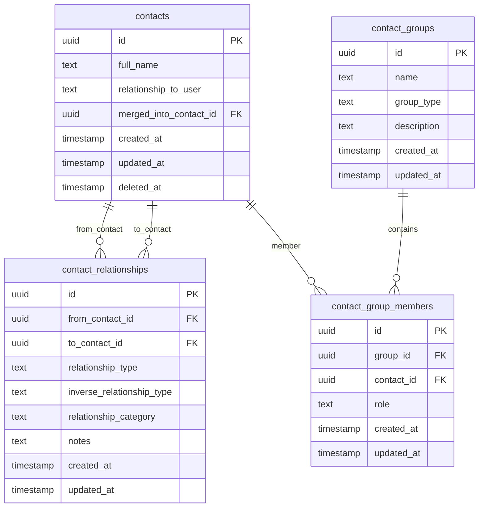
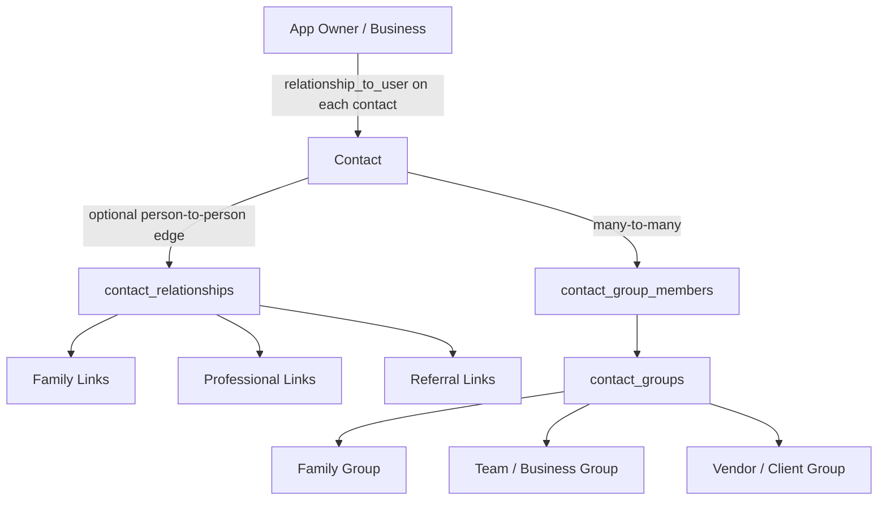
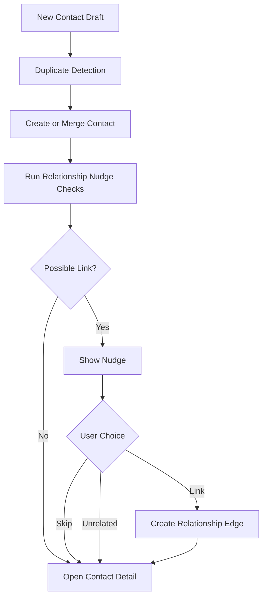

# Relationship Sector Design

## Purpose

This document defines the relationship model for the Smart Contact Manager.

The goal is to support useful contact linking without forcing users to maintain a complex graph during contact creation.

## Core Decisions

- Initial contact creation only asks for optional `relationship_to_user`.
- Contact-to-contact relationships are optional and added through nudges or post-save actions.
- Family relationships have limited bidirectional display rules.
- Professional relationships are one-way by default.
- Team membership belongs in groups, because one contact can belong to multiple teams/groups.
- Referral is a one-way relationship edge, not a separate table.
- Same-last-name relationship detection is only a soft nudge with Skip and Unrelated actions.
- The app assumes a single app owner/business for the MVP.

## Relationship Sector ER Diagram



## Relationship Concept Map



## Creation-Time Relationship Model

During initial contact creation, the only relationship field shown is:

```text
Relationship to Me
```

Examples:

- Client
- Vendor
- Accountant
- Attorney
- Contractor
- Friend
- Other

This maps to:

```text
contacts.relationship_to_user
```

It does not create a `contact_relationships` row.

One app owner/business can have many contacts related to them. Since this MVP is single-user, we do not need a separate `users` table just to model that.

## Optional Relationship Nudge Flow



Nudges should not block contact creation.

Possible nudge signals:

- Same last name.
- Same company.
- Same email domain.
- Same website domain.
- Same address.
- Voice phrase such as `John is Sarah's brother`.

Nudge actions:

- Link
- Skip
- Unrelated

## Family Relationship Rules

Family links support bidirectional display for immediate relationships only.

Supported pairs:

```text
mother <-> son
mother <-> daughter
father <-> son
father <-> daughter
brother <-> brother
brother <-> sister
sister <-> sister
sister <-> brother
```

Fallback:

```text
relative <-> relative
```

Example storage:

```text
from_contact: John
to_contact: Alex
relationship_type: son
inverse_relationship_type: father
relationship_category: family
```

Meaning:

```text
From John's page: Alex is John's son.
From Alex's page: John is Alex's father.
```

The app should not compute complex labels like great uncle, second cousin, or grandson in the MVP. It can still visually show connected family nodes.

## Professional Relationship Rules

Professional relationships are one-way by default.

Examples:

```text
from_contact: Bob
to_contact: Alice
relationship_type: accountant
relationship_category: business
inverse_relationship_type: null
```

Meaning:

```text
Alice is Bob's accountant.
```

The app does not automatically infer:

```text
Bob is Alice's client.
```

If that relationship matters, the user can add it separately.

## Team And Group Rules

Team membership should use groups, not person-to-person `team_member` edges.

Reason:

- A contact can belong to multiple teams.
- A group can hold roles.
- Team graphs become noisy if every teammate is linked to every other teammate.

Example:

```text
contact_groups:
  ABC Realty Team

contact_group_members:
  John Smith, role: Sales Manager
  Sarah Doe, role: Broker
  Aman Patel, role: Contractor
```

## Referral Rule

Referral is stored as a one-way relationship edge.

Example:

```text
Sarah Doe referred John Doe.
```

Storage:

```text
from_contact: John Doe
to_contact: Sarah Doe
relationship_type: referred_by
relationship_category: business
inverse_relationship_type: null
```

Display:

```text
John Doe: Referred by Sarah Doe
Sarah Doe: Referred John Doe
```

Do not store `referred_to` as a separate relationship type. That is display wording derived from `referred_by`.

## Relationship Direction Rule

`relationship_type` is always read from `from_contact` toward `to_contact`.

Example:

```text
from_contact: John
to_contact: Alex
relationship_type: son
```

Meaning:

```text
Alex is John's son.
```

This rule prevents relationship direction confusion during implementation.
