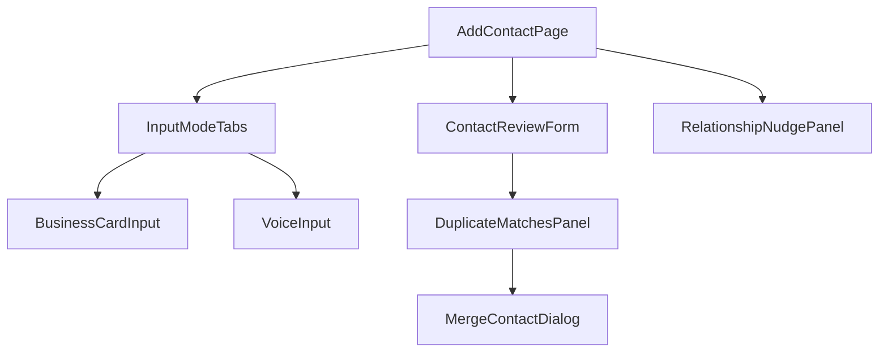
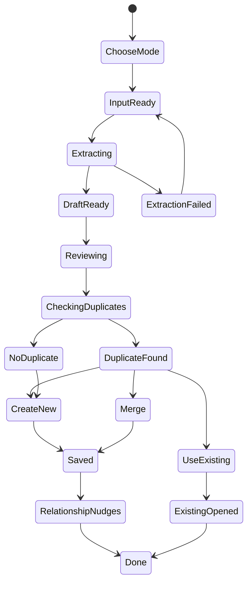
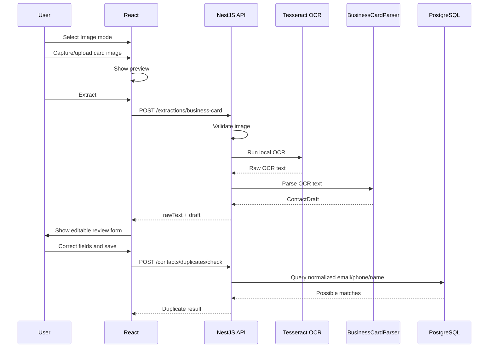
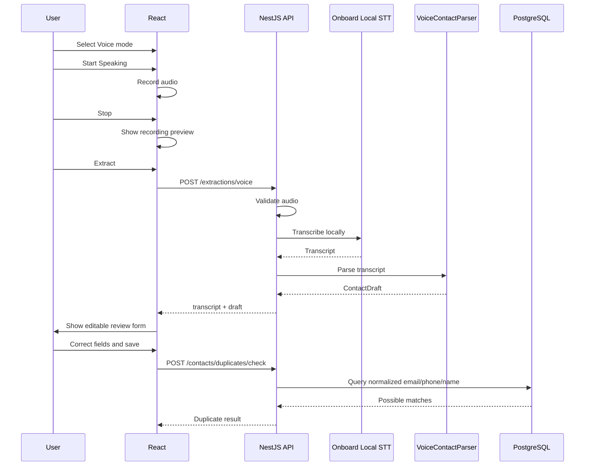

# Add Contact UX Flow

## Goal

Allow the user to create a contact through:

- Business card image input.
- Voice input.
- Manual correction before save.

Both image and voice modes create a `ContactDraft`. The user reviews the draft, duplicate detection runs, and only then is a contact saved or merged.

## Page Route

```text
/contacts/new
```

## Main Screen Structure

```text
Add Contact

[ Image ] [ Voice ]

Mode-specific input area

Extracted Contact Review Form

Duplicate / Merge panel when needed

Optional relationship/referral nudges after save
```

## Component Map



## Shared Add Contact State Machine



## Image Mode Flow

### User Path

1. User opens Add Contact.
2. User selects Image mode.
3. User captures or uploads a business card.
4. App shows image preview.
5. User taps Extract.
6. React sends image to NestJS.
7. Backend validates file.
8. Backend runs image preprocessing.
9. Backend runs Tesseract OCR.
10. Backend cleans OCR text.
11. Backend parses business-card text into `ContactDraft`.
12. React fills the review form.
13. User edits fields.
14. User taps Check & Save.
15. Backend checks duplicates.
16. User chooses Use Existing, Merge, or Create New.
17. Contact is saved or merged.
18. App may show optional relationship/referral nudges.

### Image Flow Diagram



### Image Mode Edge Cases

#### No file selected

UI:

- Disable Extract.
- Show helper text near upload area.

Backend:

- Return `400 FILE_REQUIRED` if endpoint is called without file.

#### Unsupported file type

Examples:

- PDF
- HEIC if unsupported
- corrupted image

UI:

- Show clear file type error.
- Preserve mode selection.

Backend:

- Return `400 UNSUPPORTED_IMAGE_TYPE`.

#### File too large

UI:

- Explain max file size.
- Let user choose another image.

Backend:

- Return `413 FILE_TOO_LARGE`.

#### Camera permission denied

UI:

- Fall back to file upload.
- Do not block the page.

#### OCR returns no text

UI:

- Show: "No readable text found. Try a clearer photo or enter manually."
- Keep image preview.
- Allow manual entry.

Backend:

- Save failed/partial `extraction_attempts` row if configured.

#### OCR text is messy

UI:

- Show editable fields.
- Optionally show raw extracted text in a collapsible panel.

Backend:

- Return low confidence where possible.

#### Multiple emails/phones detected

UI:

- Add all detected values.
- Allow user to remove or mark primary.

#### Name not detected

UI:

- Let user manually enter name.
- Allow save if at least one useful identifier exists, depending validation rule.

Recommended validation:

```text
Require full_name OR email OR phone.
```

#### Business relationship not detected

UI:

- Leave Relationship to Me empty.
- Do not force selection.

#### User changes mode after extraction

UI:

- Warn only if unsaved edited draft would be lost.
- Better: keep current draft and ask whether new extraction should replace or merge into draft.

Options:

- Replace current draft
- Merge into current draft
- Cancel

## Voice Mode Flow

### User Path

1. User opens Add Contact.
2. User selects Voice mode.
3. User taps Start Speaking.
4. Browser records audio.
5. User taps Stop.
6. App shows recording duration and optional playback.
7. User taps Extract.
8. React uploads audio to NestJS.
9. Backend validates audio.
10. Backend preprocesses audio.
11. Backend runs onboard local STT.
12. Backend cleans transcript.
13. Backend parses natural language into `ContactDraft`.
14. React fills the review form.
15. User edits fields.
16. Duplicate detection and save flow continues.

### Voice Flow Diagram



### Voice Mode Edge Cases

#### Microphone permission denied

UI:

- Show permission message.
- Offer manual entry fallback.
- Keep user in Voice mode.

#### No speech detected

UI:

- Show: "No speech detected. Try again or type manually."
- Allow re-record.

Backend:

- Return `422 NO_SPEECH_DETECTED`.

#### Recording too long

UI:

- Show countdown/limit.
- Auto-stop at max duration.

Backend:

- Return `413 AUDIO_TOO_LONG` if exceeded.

#### Audio format unsupported

UI:

- Show browser compatibility error.

Backend:

- Return `400 UNSUPPORTED_AUDIO_TYPE`.

#### STT model unavailable

This is unacceptable as a final demo state, but the app still needs a graceful error.

UI:

- Show: "Local speech model is not available. Check backend setup."
- Preserve audio recording.

Backend:

- Return `503 LOCAL_STT_UNAVAILABLE`.
- Include setup hint in server logs, not in noisy UI.

#### Transcript has spoken email

Example:

```text
john at abc dot com
```

Expected cleanup:

```text
john@abc.com
```

#### Transcript has spoken numbers

Example:

```text
five one eight five five five one one one one
```

Expected cleanup:

```text
5185551111
```

#### User gives partial info

Example:

```text
John from ABC Realty, vendor.
```

UI:

- Fill known fields.
- Leave unknown fields blank.
- Do not pretend confidence is high.

#### User says referral

Example:

```text
John Doe, referred by Sarah Doe.
```

Expected behavior:

- If Sarah Doe exists, show optional referral nudge after save.
- If Sarah Doe does not exist, show optional create/link flow.
- Do not block contact save.

#### User says relationship

Example:

```text
John Doe is Sarah Doe's brother.
```

Expected behavior:

- Create a relationship suggestion.
- User must confirm.
- Provide Skip and Unrelated options.

## Review Form Flow

The review form is shared by image and voice modes.

Fields:

- Full Name
- Designation/Title
- Company
- Relationship to Me
- Emails
- Phones
- Websites
- Address

Optional advanced panel:

- Raw extracted text/transcript
- Extraction source
- Confidence indicators

## Save And Duplicate Flow

### Save Button Behavior

Button label:

```text
Check & Save
```

Reason:

- The app should check duplicates before creating a contact.

### Duplicate Detection Request

```text
POST /contacts/duplicates/check
```

Payload:

```json
{
  "fullName": "John Doe",
  "company": "ABC Realty",
  "emails": ["john@abc.com"],
  "phones": ["5185551111"],
  "websites": ["abc.com"]
}
```

### No Duplicates

Flow:

```text
Create contact directly.
```

API:

```text
POST /contacts
```

### Duplicates Found

UI shows matching contacts with:

- Name
- Company
- Email/phone overlap
- Match reason
- Score or confidence label

Actions:

- Use Existing
- Merge
- Create New

### Use Existing

Behavior:

- Do not create a new contact.
- Navigate to existing contact detail.

### Merge

Behavior:

- Open merge dialog.
- Show existing values and new draft values.
- User confirms field choices.
- Backend performs merge.

API:

```text
POST /contacts/:id/merge
```

### Create New

Behavior:

- Save new contact even though duplicates were found.
- Optional warning confirmation if match confidence is high.

## Post-Save Nudges

After save, show optional nudge cards.

Examples:

```text
John Doe may be related to Sarah Doe.
[Link] [Skip] [Unrelated]
```

```text
John Doe was mentioned as referred by Sarah Doe.
[Confirm Referral] [Skip]
```

Rules:

- Never force a relationship.
- Never prevent navigation.
- Keep nudges compact.

## Validation Rules

Recommended minimum:

```text
At least one of full_name, email, or phone is required.
```

Field validation:

- Email must be valid if present.
- Phone is normalized before duplicate checks.
- Website is normalized before save.
- Relationship to Me accepts fixed suggestions plus custom values.

## Backend API Summary

```text
POST /extractions/business-card
POST /extractions/voice
POST /contacts/duplicates/check
POST /contacts
POST /contacts/:id/merge
POST /contacts/:id/relationships
```

## React State Considerations

Keep these values in page state until save:

- selected mode
- uploaded image preview
- recorded audio blob
- raw extracted text/transcript
- editable draft
- duplicate match results
- relationship suggestions

Do not clear state after recoverable errors.
