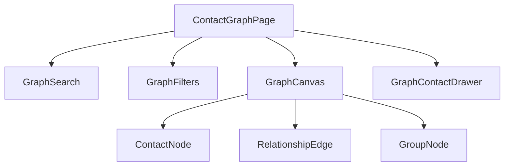
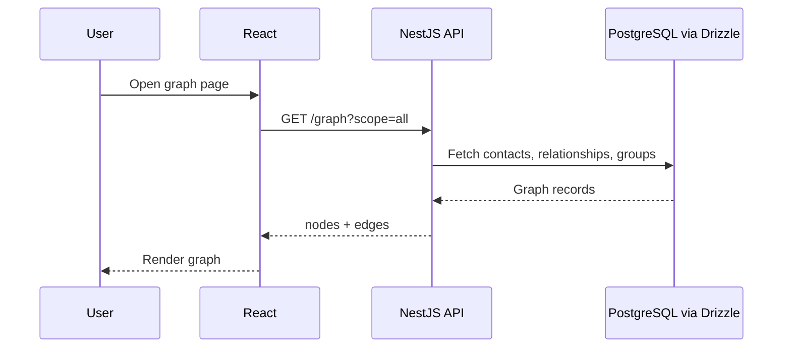
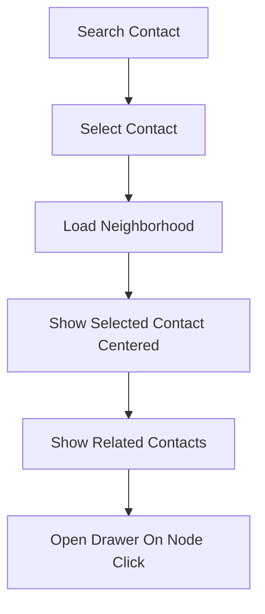

# Contact Graph UX Flow

## Goal

Show contacts as a graph of optional relationships and groups.

This is the third major page. It is documented now, but implementation should come after Add Contact and Contact List/export are stable.

## Page Route

```text
/graph
```

## Graph Scope

The graph should visualize:

- Family relationships.
- Professional one-way relationships.
- Referral links.
- Group membership.

The graph should not try to compute complex genealogy labels in the MVP.

## Main Screen Structure

```text
Graph Header
Search / Focus Contact
Filters
Graph Canvas
Contact Drawer
```

## Component Map



## Graph Data Flow



## Graph Node Types

### Contact Node

Shows:

- Name
- Company or relationship to user
- Small badge for source/relationship type if useful

### Group Node

Shows:

- Group name
- Group type

### Edge Types

Family:

```text
solid line
```

Professional:

```text
directional arrow
```

Referral:

```text
directional arrow labeled Referred by
```

Group membership:

```text
dashed line
```

## Focused Contact Flow



Recommended default:

- Start with a search/focus flow, not a giant graph.

Reason:

- Large graphs become unreadable quickly.
- Focused graph is easier to implement and demo.

## Graph Filters

Filters:

- Family
- Professional
- Referral
- Groups

Optional:

- Relationship to Me
- Company
- Group type

## Contact Drawer

Clicking a node opens a drawer with:

- Contact name
- Company/designation
- Email/phone quick view
- Relationship summary
- Open Contact button
- Export VCF button

## Edge Cases

### No contacts

UI:

- Show empty graph state.
- Provide Add Contact action.

### Contacts exist but no relationships

UI:

- Show searchable contacts.
- Explain that relationships appear after linking contacts or adding groups.

### Too many nodes

UI:

- Use focused graph.
- Limit depth.
- Show "Load more connections."

Backend:

- Support query parameters:

```text
GET /graph?contactId=...&depth=1
```

### Circular relationships

Graphs can have cycles.

UI:

- Render as graph, not tree.

Backend:

- Avoid recursive queries without depth limits.

### Merged/deleted contacts

UI:

- Hide by default.

Backend:

- Exclude `deleted_at` contacts and contacts with `merged_into_contact_id` unless explicitly requested.

### Missing inverse label

Professional and referral edges may not have inverse labels.

UI:

- Display the one-way label only.

### Unknown relationship type

UI:

- Display humanized custom label.

### Group with many contacts

UI:

- Collapse group node.
- Expand on click.

## Backend API Summary

```text
GET /graph
GET /graph?contactId=:id&depth=1
```

Response shape:

```json
{
  "nodes": [
    {
      "id": "contact_1",
      "type": "contact",
      "label": "John Doe"
    }
  ],
  "edges": [
    {
      "id": "edge_1",
      "from": "contact_1",
      "to": "contact_2",
      "type": "referred_by",
      "category": "business",
      "directional": true
    }
  ]
}
```

## Implementation Note

The graph view should use the existing `contacts`, `contact_relationships`, `contact_groups`, and `contact_group_members` tables. It should not require new schema for MVP.
