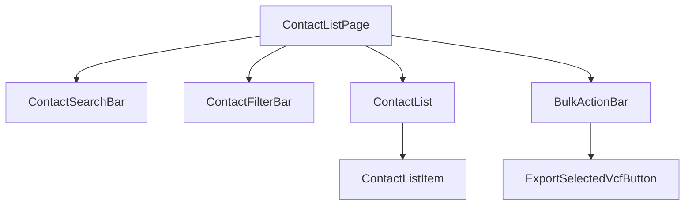
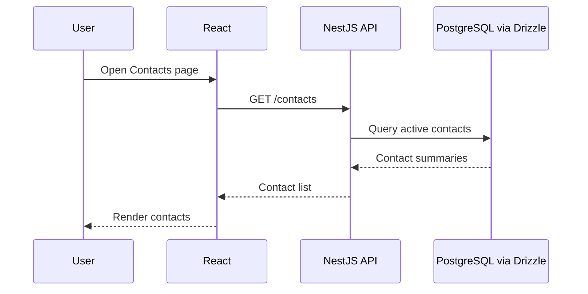
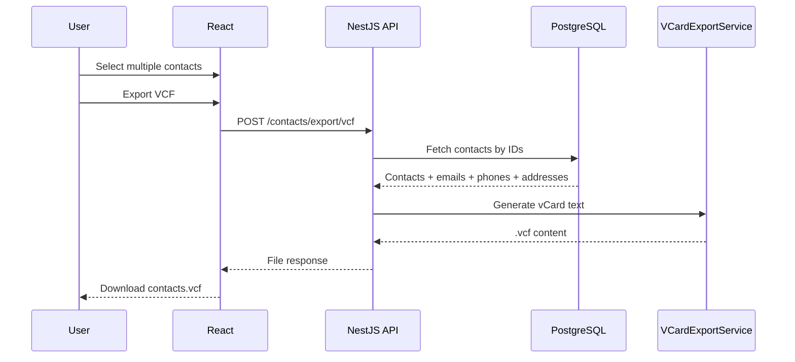

# Contact List, Detail, And vCard Export UX Flow

## Goal

Allow users to browse contacts, open one contact, export one contact to `.vcf`, select multiple contacts, and export multiple contacts to `.vcf`.

This page proves that the app is a contact manager, not only an OCR/voice extraction demo.

## Page Routes

```text
/contacts
/contacts/:id
```

## Contact List Screen

### Primary Layout

Desktop:

```text
Header: Contacts
Search bar
Filters
Table/List
Bulk action bar when contacts selected
```

Mobile:

```text
Header: Contacts
Search bar
Filter button
Contact cards
Sticky bulk action bar when selected
```

## Contact List Component Map



## Contact List Data Flow



## Contact List Item Content

Each item should show:

- Display name
- Company
- Designation
- Primary phone
- Primary email
- Relationship to Me
- Small indicators for groups/relationships if present

Do not show every field in the list. The list should be scannable.

## Search Flow

### User Path

1. User types in search bar.
2. React debounces input.
3. React calls backend search.
4. Backend searches name, company, email, phone, and website.
5. List updates.

API:

```text
GET /contacts?search=john
```

### Search Edge Cases

#### Empty search

Behavior:

- Show default recent/alphabetical contacts.

#### No results

UI:

```text
No contacts found.
[Add Contact]
```

#### Search by phone formatting

User may type:

```text
518-555-1111
```

Backend should normalize and search:

```text
5185551111
```

#### Search by email case

Search should be case-insensitive.

#### Search while offline/backend unavailable

UI:

- Keep current list if loaded.
- Show error banner.

## Filter Flow

Useful filters:

- Relationship to Me
- Company
- Group
- Has email
- Has phone
- Created from Image
- Created from Voice

API:

```text
GET /contacts?relationshipToUser=Vendor
GET /contacts?groupId=...
GET /contacts?source=voice
```

## Selection Flow

### Desktop

- Checkbox per row.
- Select all visible.
- Bulk action bar appears when at least one selected.

### Mobile

- Long press or checkbox mode.
- Sticky bulk action bar.

Bulk bar:

```text
3 selected
[Export VCF] [Clear]
```

## Multi-Contact vCard Export Flow

### User Path

1. User selects multiple contacts.
2. User clicks Export VCF.
3. React sends selected IDs to backend.
4. Backend fetches contacts and details.
5. Backend generates one `.vcf` file containing multiple vCards.
6. Browser downloads file.

### Flow Diagram



### API

```text
POST /contacts/export/vcf
```

Request:

```json
{
  "contactIds": ["id_1", "id_2", "id_3"]
}
```

Response:

```text
Content-Type: text/vcard
Content-Disposition: attachment; filename="contacts.vcf"
```

## Multi-Export Edge Cases

### No contacts selected

UI:

- Disable Export VCF.

### Some selected contacts were deleted/merged

Backend:

- Exclude hidden merged contacts by default.
- Return warning metadata if using JSON preflight, or log server-side.

UI:

- If export fails, show which contacts could not be exported.

### Contact has no name

vCard fallback:

- Use email or phone as display name.

### Contact has multiple emails/phones

vCard:

- Export all.
- Mark primary where possible.

### Contact has relationship graph data

MVP export:

- Export standard contact fields.
- Do not export full internal graph unless mapping is clean.

Reason:

- vCard relationship support exists, but not all contact apps display it consistently.
- Better to export reliable name/email/phone/company/title/address/website first.

## Contact Detail Screen

### User Path

1. User clicks a contact from list.
2. App opens detail page.
3. User views contact details.
4. User can edit, export, add relationships/groups, or open graph.

## Contact Detail Layout

```text
Contact Header
  Name
  Company
  Designation
  Relationship to Me
  [Export VCF]

Contact Methods
  Emails
  Phones
  Websites
  Addresses

Relationships
  Referred by
  Family links
  Professional links

Groups
  Group memberships

Actions
  Edit
  Add Relative
  Add Professional Link
  Add to Group
  View in Graph
```

## Single Contact vCard Export Flow

### User Path

1. User opens contact detail.
2. User clicks Export VCF.
3. React calls backend.
4. Backend generates vCard for one contact.
5. Browser downloads `.vcf`.

API:

```text
GET /contacts/:id/export/vcf
```

Response:

```text
Content-Type: text/vcard
Content-Disposition: attachment; filename="john-doe.vcf"
```

## Single Export Edge Cases

### Contact not found

UI:

- Show not found state.
- Provide back to Contacts.

Backend:

- Return `404 CONTACT_NOT_FOUND`.

### Contact was merged into another contact

UI:

- Redirect or show message:

```text
This contact was merged into John Doe.
[Open John Doe]
```

Backend:

- Return `409 CONTACT_MERGED` or redirect-style metadata.

### Contact has invalid field values

Backend:

- Sanitize vCard output.
- Skip invalid optional fields rather than failing whole export.

### Browser blocks download

UI:

- Provide retry button.
- Use normal anchor download if possible.

## Detail Edit Flow

Editing is not the first focus, but basic edit should exist.

Flow:

```text
View Contact -> Edit -> Save -> Detail
```

Validation:

- Same as Add Contact.
- Duplicate detection should run if email/phone/name changes significantly.

## Add Relationship From Detail

Relationship actions should start from detail, not from the first creation burden.

### Add Relative

```text
Add Relative -> Search Existing -> Select -> Choose Type -> Save
```

### Add Professional Link

```text
Add Professional Link -> Search Existing -> Select -> Choose Type -> Save
```

### Add Referral Source

```text
Add Referral Source -> Search Existing -> Save referred_by edge
```

### Add To Group

```text
Add to Group -> Search/Create Group -> Optional Role -> Save
```

## Relationship Edge Cases

### User links contact to itself

Backend:

- Reject with `400 SELF_RELATIONSHIP_NOT_ALLOWED`.

### Duplicate relationship exists

UI:

- Show "This relationship already exists."

Backend:

- Enforce unique `from_contact_id + to_contact_id + relationship_type`.

### Family inverse unclear

UI:

- Ask explicit direction.

Example:

```text
How is Sarah related to John?
[Mother] [Daughter] [Sister] [Relative]
```

### Group already contains contact

UI:

- Show existing membership instead of duplicate add.

Backend:

- Enforce unique `group_id + contact_id`.

## Backend API Summary

```text
GET /contacts
GET /contacts/:id
PATCH /contacts/:id
GET /contacts/:id/export/vcf
POST /contacts/export/vcf
POST /contacts/:id/relationships
POST /contacts/:id/groups
```

## vCard Field Mapping

Recommended export fields:

```text
FN -> display_name or full_name
N -> family_name/given_name when available
ORG -> company
TITLE -> designation
EMAIL -> contact_emails
TEL -> contact_phones
URL -> contact_websites
ADR -> contact_addresses
NOTE -> optional simple notes
```

Do not include internal IDs in exported vCards.

## Important Product Boundary

The Contacts page is the app's operational center.

The user should be able to:

- find contacts,
- open a contact,
- export one contact,
- export many contacts,
- and add new contacts

without needing to understand OCR, STT, Drizzle, relationships, or graph internals.
