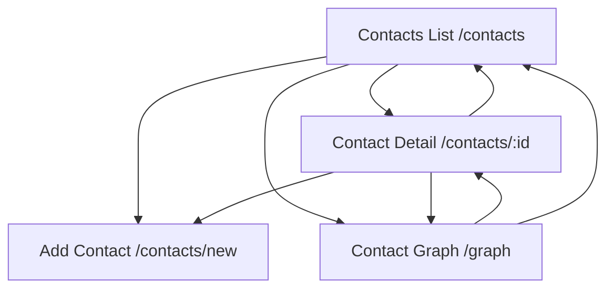

# Navigation Map

## Main Pages

The app is organized around three main pages:

```text
/contacts/new
/contacts
/graph
```

Recommended labels:

```text
Add Contact
Contacts
Graph
```

## Navigation Diagram



## Layout Pattern

Use a simple responsive app shell:

- Top bar with app name and primary navigation.
- Primary action button: Add Contact.
- Mobile bottom or top navigation with the same three destinations.

Desktop:

```text
Top Nav: Contacts | Add Contact | Graph
Primary content area
```

Mobile:

```text
Header
Primary content
Bottom nav or compact top tabs
```

## Route Responsibilities

### `/contacts/new`

Purpose:

- Add a contact using image OCR, voice input, or manual entry fallback.

Primary components:

- `AddContactPage`
- `InputModeTabs`
- `BusinessCardInput`
- `VoiceInput`
- `ContactReviewForm`
- `DuplicateMatchesPanel`
- `RelationshipNudgePanel`

### `/contacts`

Purpose:

- Search, filter, select, export, and open contacts.

Primary components:

- `ContactListPage`
- `ContactSearchBar`
- `ContactFilterBar`
- `ContactTable`
- `BulkActionBar`
- `VcfExportButton`

### `/contacts/:id`

Purpose:

- View one contact, export one contact, edit details, add optional relationships/groups.

Primary components:

- `ContactDetailPage`
- `ContactHeader`
- `ContactInfoSections`
- `RelationshipSummary`
- `GroupsPanel`
- `ExportVcfButton`

### `/graph`

Purpose:

- Visualize relationship and group connections.

Primary components:

- `ContactGraphPage`
- `GraphCanvas`
- `GraphFilters`
- `GraphContactDrawer`

## Global Edge Cases

### Backend unavailable

React behavior:

- Show a non-blocking error banner.
- Keep user-entered form values in local component state.
- Allow retry.

Backend behavior:

- Return consistent error envelopes.

Example:

```json
{
  "error": {
    "code": "SERVICE_UNAVAILABLE",
    "message": "The server is temporarily unavailable."
  }
}
```

### Validation errors

React behavior:

- Highlight affected fields.
- Keep all user-entered values.
- Do not clear uploaded image/audio preview.

NestJS behavior:

- Validate DTOs.
- Return field-level errors.

### Empty database

Contacts page:

- Show empty state with Add Contact action.

Graph page:

- Show empty graph state with Add Contact action.

### Mobile viewport

All pages must support:

- Narrow width.
- Touch-friendly controls.
- Camera capture input.
- Audio recording controls.
- No horizontal overflow.

### Slow processing

OCR and STT may take time.

React behavior:

- Show clear processing state.
- Disable duplicate submissions.
- Allow cancel/back where safe.

Backend behavior:

- Avoid creating contacts during extraction.
- Return extraction result only after draft is ready.
