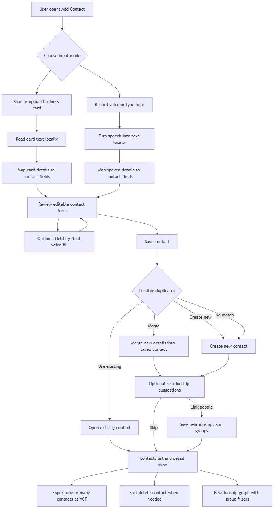
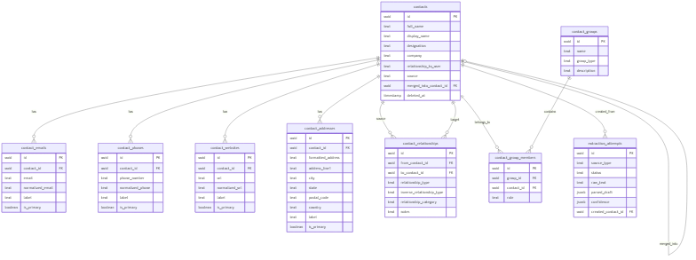

# Business Card Scanner & Smart Contact Manager

## Submission Links

Recorded demo video:

```text
PASTE_GOOGLE_DRIVE_OR_ZOHO_LINK_HERE
```

Source code archive:

```text
PASTE_GOOGLE_DRIVE_OR_ZOHO_LINK_HERE
```

## Project Summary

This project implements a smart contact manager using NestJS, PostgreSQL, Drizzle ORM, and React. Users can create contacts from business card OCR, local voice input, or manual entry. The system extracts contact details into an editable draft, checks for duplicates, supports merge/use-existing/create-new choices, stores relationships and groups, exports contacts as VCF, and visualizes relationship graphs.

## Reviewer Quick Start

Docker quick start:

```bash
docker compose up --build
```

Open the app:

```text
http://localhost:5173
```

Useful Docker URLs:

- Frontend: `http://localhost:5173`
- Backend API: `http://localhost:3000`
- Adminer: `http://localhost:8080`

Default database credentials:

```text
System: PostgreSQL
Server: postgres
Username: bhumio
Password: bhumio_dev_password
Database: bhumio_contacts
```

The API container applies Drizzle migrations on startup. It also loads sample data only when the database is empty, so reviewer-created contacts are not wiped on container restart.

If ports are already in use:

```bash
API_PORT=3002 WEB_PORT=5174 docker compose up --build
```

PowerShell:

```powershell
$env:API_PORT='3002'; $env:WEB_PORT='5174'; docker compose up --build
```

## Implemented Requirements

### Business Card Scanner

Implemented with local Tesseract OCR.

Supported extracted fields:

- Full Name
- Designation/Title
- Company
- Email
- Phone Number
- Website
- Address
- Business Relationship

### Voice-Based Contact Entry

Implemented using browser audio recording and a backend local faster-whisper transcription runner. No cloud speech API is required. The resulting transcript is parsed into the same editable contact draft as the OCR pipeline.

### Duplicate Detection

Implemented while creating contacts using:

- Name
- Email
- Phone

When matches exist, the UI allows:

- Use Existing
- Merge
- Create New

### Contact Relationship Grouping

Implemented with:

- Direct contact-to-contact relationships
- Named contact groups
- Graph view with relationship edges and group coloring
- Support for a contact belonging to multiple groups

### Contact Management

Additional implemented contact manager features:

- Contact list
- Contact detail view
- Add relationships after save
- Add contacts to groups
- Export single or multiple contacts as `.vcf`
- Soft delete contacts
- Relationship graph visualization

## Architecture

Both OCR and voice pipelines produce the same contact draft shape. After draft creation, the rest of the workflow is shared:

1. Review editable draft.
2. Detect duplicates.
3. Use existing, merge, or create new.
4. Optionally link relationships/groups.
5. Save in PostgreSQL.
6. Show in list, detail, VCF export, and graph.

## Application Flow



## Database ER Diagram



## Database Design

Main tables:

- `contacts`
- `contact_emails`
- `contact_phones`
- `contact_websites`
- `contact_addresses`
- `contact_relationships`
- `contact_groups`
- `contact_group_members`
- `extraction_attempts`

Relationships:

- One contact has many emails, phones, websites, and addresses.
- Contacts can link to other contacts through `contact_relationships`.
- Contacts can belong to many groups through `contact_group_members`.
- Groups can contain many contacts.

## API Design

Important REST endpoints:

- `POST /extractions/business-card`
- `POST /extractions/voice`
- `GET /contacts`
- `POST /contacts`
- `GET /contacts/:id`
- `DELETE /contacts/:id`
- `POST /contacts/duplicates/check`
- `POST /contacts/:id/merge`
- `POST /contacts/:id/relationships`
- `GET /contacts/groups`
- `POST /contacts/:id/groups`
- `GET /contacts/graph`
- `GET /contacts/:id/vcf`
- `GET /contacts/export/vcf?ids=id1,id2`

## Setup Instructions

Recommended Docker setup:

```bash
docker compose up --build
```

Manual local setup:

```bash
npm install
npm run dev:infra
npm run db:migrate
npm run db:seed
npm run dev:api
npm run dev:web -- --host 0.0.0.0
```

Frontend:

```text
http://localhost:5173
```

Backend:

```text
http://localhost:3000
```

## Test Commands

```bash
npm run test:unit
npm run test:e2e
npm run build
npm run test:ocr
```

Full test command:

```bash
npm run test
```

## Packaging Checklist

Before uploading the source archive:

- Include source code, `documentation/`, `docs/`, `datasets/business-cards/labels.csv`, and sample data scripts.
- Include `.env.example` files, not private `.env` files.
- Exclude `node_modules`, `dist`, local logs, and Docker volumes.
- Keep the demo video link and source archive link public.
- Do not submit a GitHub or GitLab repository link.
- In the demo, show business card scan, voice fill, duplicate handling, relationship linking, group graph, contact export, and contact deletion.

## Sample Data

Sample data is provided through:

```bash
npm run db:seed
```

It creates demo contacts, Bhumio group membership, family relationships, and work partner relationships.

Current sample data includes:

- Bhumio group: Tejas Kamal Sahoo, Aarav Mehta, Vinod C
- Doe Family group: John Doe, Sarah Doe, Jane Doe, Jack Doe
- Work partner links inside the Bhumio group
- Father, mother, son, daughter, sister, and brother links inside the Doe Family group

## Notes

OCR and speech recognition are local/offline oriented. Tesseract is used for business card OCR. Voice input records audio in the browser and sends it to the backend local STT runner.
